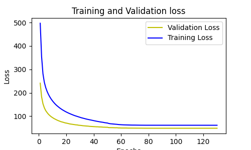

# E2E ASR experiments on Librispeech 
This experiment is conducted on 100 hours of librispeech data for the task of E2E ASR using an intermediate character level representation and Connectionist Temporal Classifications(CTC) loss function.

Transforming transcription of both train and dev set from sequence of words to sequence of characters by adding additional character(">") at the end of each word of the transcription is required to train the CTC model on character level.  

We used a beam search decoding strategy to decode the model output and return word transcription. 


## File description
* model.py: rnnt joint model
* model2012.py: graves2012 model
* train_rnnt.py: rnnt training script
* train_ctc.py: ctc acoustic model training script
* eval.py: rnnt & ctc decode
* DataLoader.py: kaldi feature loader


# Prepare Data
 * The following python programs  found in the above utils folder 
### Step 1
Prepare custom lexicon file that maps word to a sequence of characters
```
python word_to_characters.py --path [path-to-your-original-lexicon-file]
```
### Step 2
Transform the word transcription to  a sequence of characters by adding ">" at the end of each word
#### Example
 * THE SUNDAY SCHOOL  => T H E > S U N D A Y > S C H O O L >
```
python prepare_target.py --path [path-of-your-traget-file]
```

### Step 3
Retrieve unique characters from the lexicon
```
python prepare.phone.py --path [path-to-your-original-lexicon-file]
```

## Run
* Extract feature
link kaldi librispeech example dirs (`local` `steps` `utils` )
excute `run.sh` to extract 13 dim mfcc feature
run `feature_transform.sh` to get 39 dim feature 

### Train CTC acoustic model
```
python train_ctc.py --lr 1e-3 --bi --dropout 0.5 --out exp/ctc_bi_lr1e-3 --schedule
```
##### Results
###### Loss curve



### Decode 
```
python eval.py <path to best model> [--ctc] --bi
```


## Results
|model|beam width | CER(%)| WER(%)|
|-----|:---------:|:---:|:----|
|CTC  |1 | 30.47 |35.71|
|CTC | 3| 29.65| 34.86|
|CTC |10 | 31.05|34.66|


## Requirements
* Python 3.6
* PyTorch >= 0.4
* numpy 1.14
* [warp-transducer](https://github.com/HawkAaron/warp-transducer)

## Reference
* RNN Transducer (Graves 2012): [Sequence Transduction with Recurrent Neural Networks](https://arxiv.org/abs/1211.3711)
* RNNT joint (Graves 2013): [Speech Recognition with Deep Recurrent Neural Networks](https://arxiv.org/abs/1303.5778 )
* (E2E-ASR)[https://github.com/HawkAaron/E2E-ASR]
* (CTC Networks and Language Models: Prefix Beam Search Explained)[https://medium.com/corti-ai/ctc-networks-and-language-models-prefix-beam-search-explained-c11d1ee23306]
